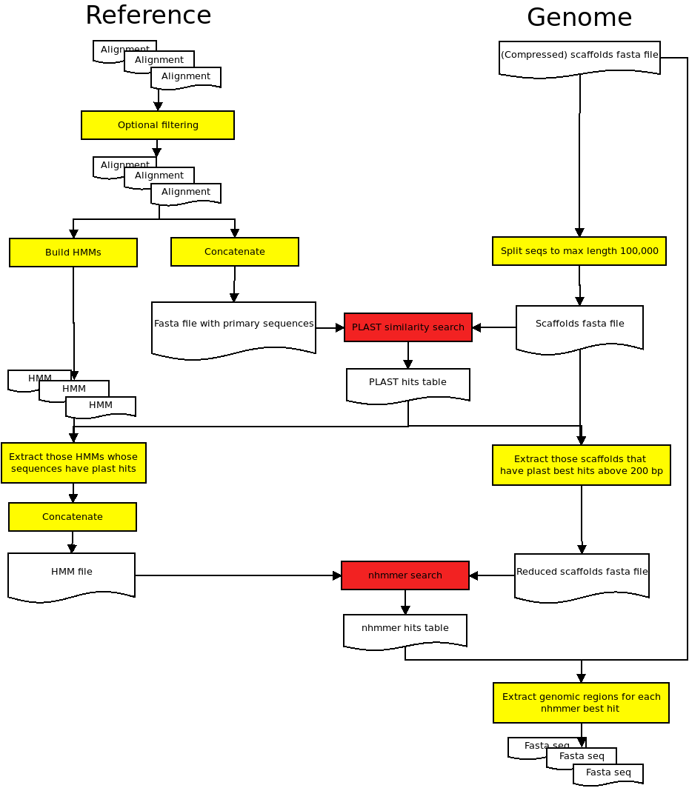

# BirdScanner on Uppmax

- Last modified: tor aug 15, 2019  12:48
- Sign: JN

## Description

The workflow will try to extract known genomic regions (based on multiple-
sequence alignments and HMMs) from genome files. The approach taken is
essentially a search with HMM's against a reference genome, with an extra step
where an initial similarity search is used to reduce the input data down to
matching HMM's and genomic regions. Both the known genomic regions (multiple
nucleotide-sequence alignments in fasta format), and the genome files (fasta
format, one or several scaffolds) must be provided by the user.

The current version is made for running on "Uppmax" (compute clusters Rackham
and Snowy, <https://www.uppmax.uu.se>).

The workflow is managed by the `make` program, and tasks are send to compute
units using the SLURM batch system implemented on Uppmax.

## Prerequisites

The workflow is tested on GNU/Linux (Ubuntu 18.04 and CentOS 7), and uses
standard Linux (bash) tools. The current version is aimed for running on
Uppmax, and hence it will load necessary software using the `module` system.
In addition, the software `plast` needs to be installed **by the user** from
the developer's site. Please see section [Software used](#software-used) below.

## Results

Individual gene files (fasta format) for each `genome` are written to the
folder `out/<genome>_nhmmer_output/`.

## Further analysis

The gene files in `out/<genome>_nhmmer_output/` can be further analyzed
(multiple sequence alignments, phylogenetic tree reconstruction, etc). One such
approach is described in the file [`run/README.trees.md`](run/README.trees.md).
Note that the exact approach needs to be tailored to your own needs.

## Steps to run the pipeline

##### 1. Start by cloning birdscanner:

    [user@rackham ~]$ git clone https://github.com/Naturhistoriska/birdscanner.git
    [user@rackham ~]$ cd birdscanner

##### 2. Set your compute account number (e.g. 'snic1234-5-678') by running

    [user@rackham birdscanner]$ make account UPPNR=snic1234-5-678

##### 3. Add correctly named and formatted genome files and reference data to the `data` folder

See instructions in section [Indata](#indata) below.

##### 4. Change directory to the `slurm` directory.

    [user@rackham birdscanner]$ cd slurm

Here you need to manually adjust (text edit) the time-asked-for in the slurm
scripts.

As a rough estimate, the "plast" step will take approx 20 mins/genome, while
the "hmmer" step will take > ~30 h/per genome. This might be a starting point:

|Script|Current `-t` setting|Comment|
|------|--------------------|-------|
|`init_and_plast.slurm.sh`|00:30:00|Change. Allow, say, 30 min x number of genomes|
|`hmmer.slurm.sh`|40:00:00|The time asked for is per genome and is *not* set by the `-t` option,|
|||but in the call to `make` (variable `HMMERTIME`)|
|`parsehmmer.slurm.sh`|00:30:00|30 min should be OK?|

##### 5. Submit the first slurm script:

    [user@rackham slurm]$ sbatch init_and_plast.slurm.sh

This step will attempt to read and reformat the reference data, create hmm's
for all alignments, perform a similarity search using plast, and finally
prepare a more restricted data for the next step. A brief progress report (as
well as any error messages) is printed to the file `init_and_plast.err`. More
details are written in the file `init_and_plast.log`.

##### 6. When finished, submit the next:

    [user@rackham1 slurm]$ sbatch hmmer.slurm.sh

This step will attempt to submit several slurm jobs to the scheduler, one for
each genome. This step is probably time consuming. A final report (as well as
any error messages) are printed to the file `hmmer.err`.

##### 7. When finished, submit the last:

    [user@rackham1 slurm]$ sbatch parsehmmer.slurm.sh

This step will attempt to parse the results from hmmer and create separate
folders with found genomic regions in the `birdscanner/out` folder, one for
each genome. A final report (as well as any error messages) are printed to the
file `parsehmmer.err`.

##### 8. Results

Individual gene files (fasta format) for each `genome` are written to the
folder `out/<genome>_nhmmer_output/`.

##### 9. Clean up (optional)

All files generated by the different steps can be deleted using

    [user@rackham1 birdscanner]$ make clean

If you wish to remove all generated files, including your reference data and
genome files, use:

    [user@rackham1 birdscanner]$ make distclean

## Notes:

- Most problems in the run will probably be associated with file formats.
  Please pay close attention to any error messages, especially in the file
  `init_and_plast.log`.
- The `Makefile` also have settings that may be changed before the run. Please
  see the first 60 lines if anything specific applies for your data.

## Indata

#### 1. Genomes

Add compressed (gzip) genome files (contig files in fasta format, nucleotide
data) to the folder `data/genomes/`. Files need to be named (example)
`<name>.gz`. The `<name>` should be unique and will be used in the output as
part of the fasta header for the extracted sequences.

#### 2. Reference alignments

Add reference sequence alignments (nucleotides, fasta format, file suffix
`.fas`) in the folder `data/reference/fasta_files`. Each alignment file would
represent one genomic region ("gene"). The name of the alignment file will be
used in downstream analyses, so they should have names that are easy to parse
(do not use spaces or special characters in the file names). Examples:
`myo.fas`, `odc.fas`, `988.fas`, `999.fas`, etc. The fasta headers are also
used in downstream analyses and should also be easy to parse. Examples,
`>Passe`, `>Ploceu`, `>Prunell`. Fasta headers needs to be unique, but the
number of sequences doesn't need to be the same in all files.

From the pool of files in `data/reference/fasta_files`, a filtered selection is
placed in the `data/reference/selected` folder by the pipeline. These steps
where designed specifically for "The Jarvis data", and is currently carried out
using the commands in the [`data/reference/Makefile`](data/reference/Makefile)
(and executed by `make refdata`). It may be possible to circumvent that step by
manually creating the necessary files (mostly untested).

We also provide filtered versions of the "Jarvis data". Please see the file
[`doc/Jarvis_et_al_2015/README.md`](doc/Jarvis_et_al_2015/README.md).

## Outdata

Individual `gene` files (fasta format) for each `genome` are written to the
folder `out/<genome>_nhmmer_output/`, with the default name
`<genome>.<gene>.fas`. The (default) fasta header contains the genome name:
`><genome>` and, in addition, some statistics from the HMMer search. The
default filenames and fasta header format can be changed by altering the call
to the script `parse_nhmmer.pl` inside the [`Makefile`](Makefile) (line
starting with `perl $(PARSENHMMER)`). This is mostly untested, however.

## Software used

- `make` (GNU Make 4.1)
- `grepfasta.pl` (provided, <https://github.com/nylander/grepfasta>)
- `hmmerbuild`, `hmmpress`, `nhmmer` (hmmer v.3.2.1, <http://hmmer.org/>)
- `makeblastdb` (ncbi-blast+ v.2.6.0+, <https://blast.ncbi.nlm.nih.gov/Blast.cgi?PAGE_TYPE=BlastDocs>)
- `parallel` (<https://www.gnu.org/software/parallel/>)
- `pigz` (<https://zlib.net/pigz/>)
- `plast` (v.2.3.1, <https://plast.inria.fr/plast-algorithm/>)
- Custom scripts in [src/](src/)

#### plast

The `plast` program needs to be installed locally on Uppmax.
Here is one way (installing in user's own `bin` folder):

    wget http://plast.gforge.inria.fr/files/plastbinary_linux_v2.3.1.tar.gz
    tar xvzf plastbinary_linux_v2.3.1.tar.gz
    cp plastbinary_linux_20160121/build/bin/plast ~/bin/plast

Or, compile (on Uppmax):

    module load cmake
    module load doxygen

    git clone https://github.com/PLAST-software/plast-library.git
    cd plast-library
    git checkout stable
    sed -i '98,99{s/^/#/}' CMakeLists.txt
    mkdir build
    cd build
    cmake ..
    make
    cp bin/PlastCmd ~/bin/plast

